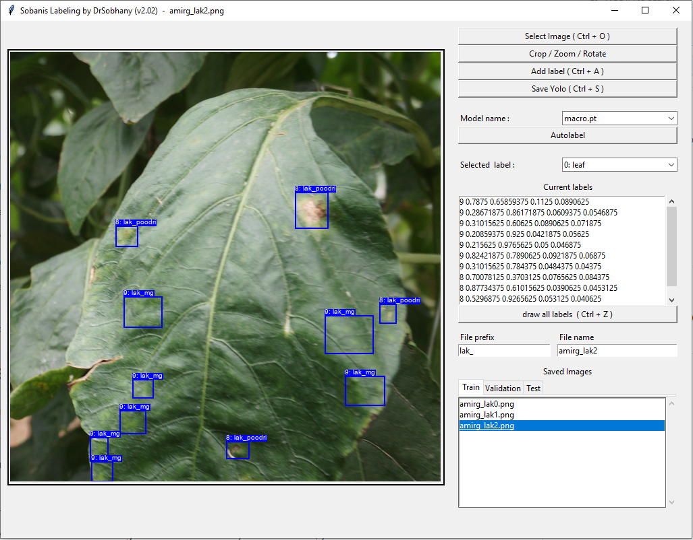

# sobanis_labeling
It is a very easy labeling tool for YOLO image detection .

Simply select an image , then you can use Crop/Edit button to rotate or crop it , 

then start labeling easily by selecting the label from dropdown list on right side and left and right clicking on the image . 

finally push add label or press Ctrl + A

In case you have labeled some images and have a relatively trained model , you can use the Auto Label button to automaticcaly label the image and then you should just correct the labeled which are automatically added to your image . 

It is the python version of this application , and as you kno there are better softwares for doing this kind of applications , So I am working on another version of it on Delphi which will be published soon . 

Feel free to fork it and pls refrence to me when doing so . 

Good luck

Dr Mehdi Sobhani
